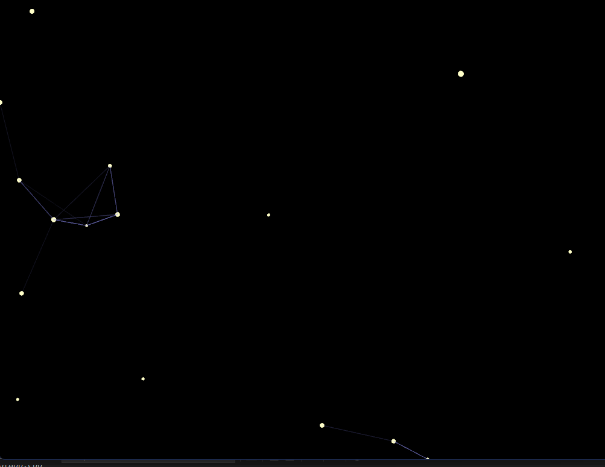
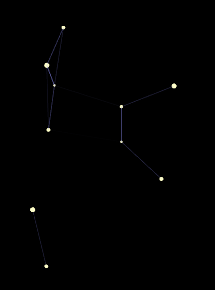
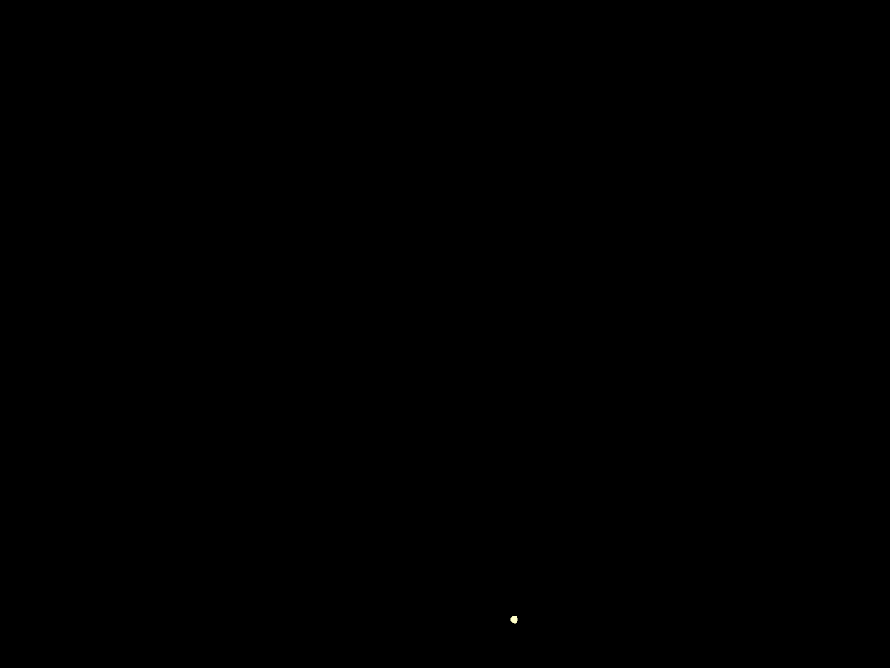
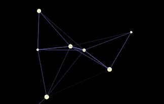

***Preguntas para guiar el proceso***

1. **Exploración creativa:** ¿Qué tipo de efecto visual quieres lograr? ¿Cómo pueden ayudarte las diferentes estructuras de datos a lograr ese efecto?

El efecto visual que quiero lograr es un cielo nocturno en movimiento, donde las estrellas aparecen, se conectan formando constelaciones y después desaparecen lentamente. Las estructuras de datos me ayudan a darle vida a esa idea. Por ejemplo, la lista enlazada permite que las conexiones entre estrellas cambien sin problema cuando alguna se elimina. La pila serviría para guardar destellos que se acumulen cuando el usuario interactúa, mientras que la cola puede simular un río de estrellas que fluyen en orden. Además, un arreglo puede mantener un fondo fijo de estrellas que siempre estén presentes.

2. **Gestión de memoria:** ¿Qué consideraciones debes tener en cuenta al gestionar dinámicamente la memoria de los objetos? ¿Cómo asegurar que no haya fugas de memoria?

Al usar memoria dinámica debo tener en cuenta que cada estrella tiene un ciclo de vida: nace, se muestra en pantalla y después muere. Cuando muere, debo liberarla de la memoria, es decir, borrarla de la lista y desconectar sus enlaces. Si no lo hago, puedo tener fugas de memoria y el programa se volvería más lento con el tiempo. También debo asegurarme de no dejar referencias a estrellas que ya fueron eliminadas, porque eso puede causar errores en la aplicación.

3. **Interacción y dinamismo:** ¿Cómo puedes hacer que la interacción del usuario influya en múltiples estructuras de datos simultáneamente para crear un efecto visual coherente y dinámico?

La interacción del usuario puede influir en varias estructuras de datos al mismo tiempo. Si el usuario hace clic, se puede añadir una nueva estrella en la lista enlazada, modificando la constelación. Si presiona teclas, se puede usar una pila para que se acumulen destellos temporales. Y si mueve el mouse, una cola puede ir dejando un rastro de estrellas ordenadas. De esta forma, el cielo digital responde al usuario de manera coherente y dinámica, siempre cambiando según lo que haga.

4. **Optimización:** ¿Qué técnicas puedes implementar para optimizar la gestión de memoria y el rendimiento de tu aplicación mientras mantienes una experiencia visual rica y fluida?

Para que el programa funcione de manera fluida, es importante usar técnicas de optimización. Una de ellas es darle a cada estrella un tiempo de vida limitado para que desaparezca sola cuando se cumpla. Otra es reutilizar objetos en lugar de crear y borrar constantemente, lo que ahorra memoria y tiempo de ejecución. También es útil poner un límite a la cantidad de estrellas que pueden existir al mismo tiempo y dibujar solo las que son visibles en pantalla. Así, la experiencia visual se mantiene rica y el rendimiento del programa no se ve afectado.

***Codigo***

**main.cpp**
```cpp
#include "ofApp.h"
#include "ofMain.h"

int main() {
	ofSetupOpenGL(1024, 768, OF_WINDOW);
	ofRunApp(new ofApp());
}
```

**ofApp.cpp**
```cpp
#include "ofApp.h"

void ofApp::setup() {
	ofBackground(0);
	ofSetFrameRate(60);
}

void ofApp::update() {
	for (int i = stars.size() - 1; i >= 0; i--) {
		stars[i]->update();
		if (stars[i]->isDead()) {
			delete stars[i];
			stars.erase(stars.begin() + i);
		}
	}
}

void ofApp::draw() {
	for (auto & star : stars) {
		star->draw();
	}

	for (int i = 0; i < stars.size(); i++) {
		for (int j = i + 1; j < stars.size(); j++) {
			float d = ofDist(stars[i]->pos.x, stars[i]->pos.y,
				stars[j]->pos.x, stars[j]->pos.y);
			if (d < 150) {
				ofSetColor(150, 150, 255, ofMap(d, 0, 150, 255, 0));
				ofDrawLine(stars[i]->pos, stars[j]->pos);
			}
		}
	}
}

void ofApp::mousePressed(int x, int y, int button) {
	ofPoint randomPos(ofRandomWidth(), ofRandomHeight());
	stars.push_back(new Star(randomPos));
}
```

**ofApp.h**
```cpp
#pragma once
#include "ofMain.h"

class Star {
public:
	ofPoint pos;
	float size;
	int lifetime;

	Star(ofPoint _pos) {
		pos = _pos;
		size = ofRandom(2, 5);
		lifetime = ofRandom(200, 400);
	}

	void update() {
		lifetime--;
	}

	void draw() {
		ofSetColor(255, 255, 200);
		ofDrawCircle(pos, size);
	}

	bool isDead() {
		return lifetime <= 0;
	}
};

class ofApp : public ofBaseApp {
public:
	void setup();
	void update();
	void draw();

	void mousePressed(int x, int y, int button);

	vector<Star *> stars;
};
```

***RAE1: Construcción de aplicaciones interactivas***

Para cumplir con este resultado construí una obra de arte generativo de constelaciones dinámicas usando openFrameworks.

* El programa crea estrellas de manera dinámica cuando se hace clic con el mouse.

* Cada estrella aparece en una posición aleatoria dentro de la pantalla, tiene un tamaño distinto y una duración de vida limitada.

* Las estrellas se van uniendo con líneas cuando están cerca, generando un efecto visual de constelaciones.

* El ciclo de vida de cada estrella está gestionado dinámicamente: cuando una estrella "muere", se libera la memoria para evitar fugas.





***RAE2: Pruebas de las partes y del todo***

**Pruebas de las partes (unitarias):**

* Probé la creación de una estrella individual para verificar que aparecía en pantalla con un tamaño y posición aleatoria.

* Verifiqué que la duración de vida funcionaba, esperando varios segundos hasta que la estrella desapareciera.

* Revisé que, al desaparecer, la estrella se eliminaba correctamente de la memoria para que no hubiera fugas.

* Probé que las líneas solo se dibujaban cuando las estrellas estaban cerca (distancia menor a 150).

**Pruebas del todo (integración):**

* Hice clics en varias zonas para comprobar que las estrellas aparecían siempre en posiciones aleatorias.

* Observé cómo las estrellas viejas se iban eliminando mientras se mantenían las nuevas, asegurando que el programa siempre estuviera fluido.

* Probé la interacción repetida (muchos clics seguidos) para comprobar que la memoria no se llenaba y la aplicación seguía estable.

* Verifiqué que el efecto visual final fuera coherente y se asemejara a una constelación dinámica.





***Prueba en video***

[Video](https://www.youtube.com/watch?v=T8_UXdG8VJM)