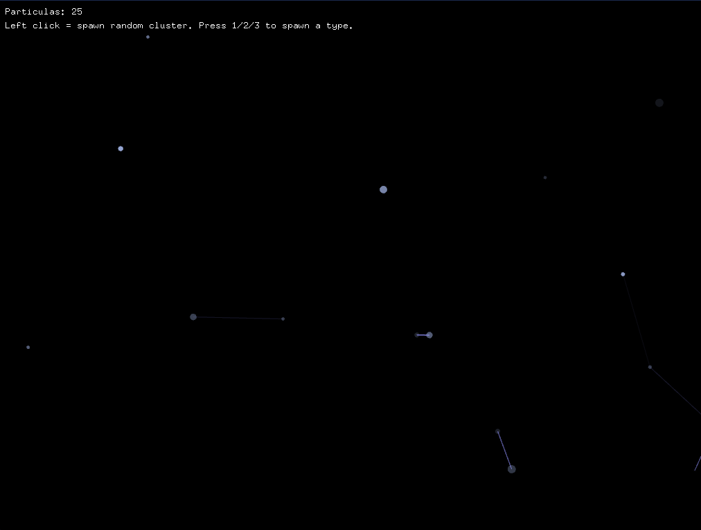
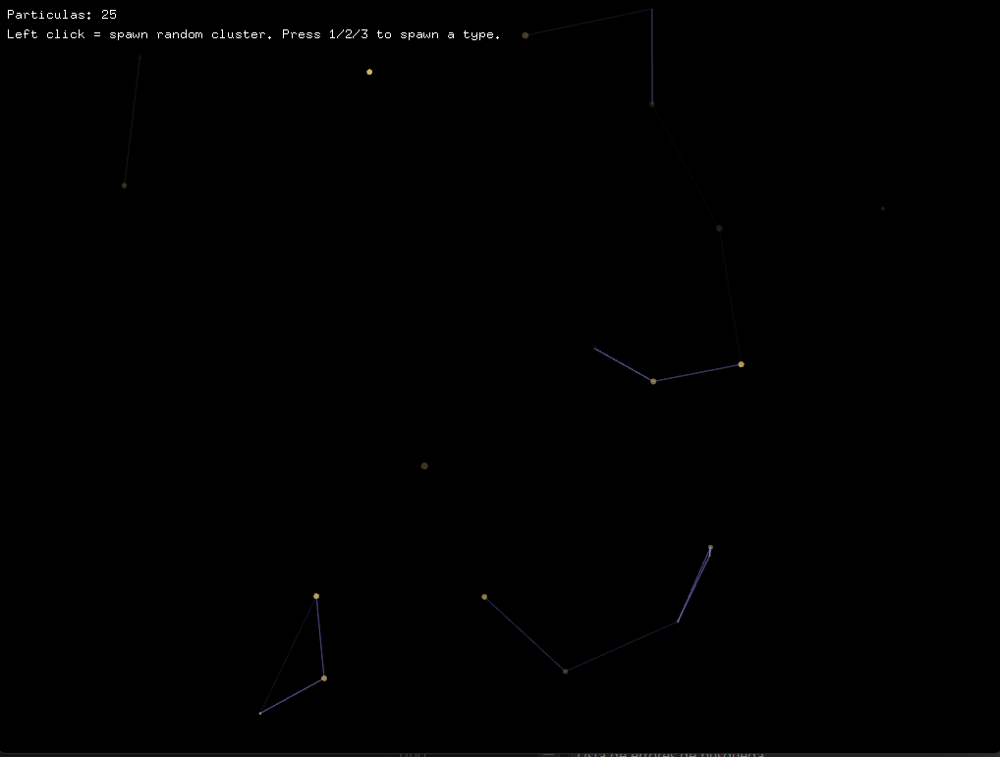
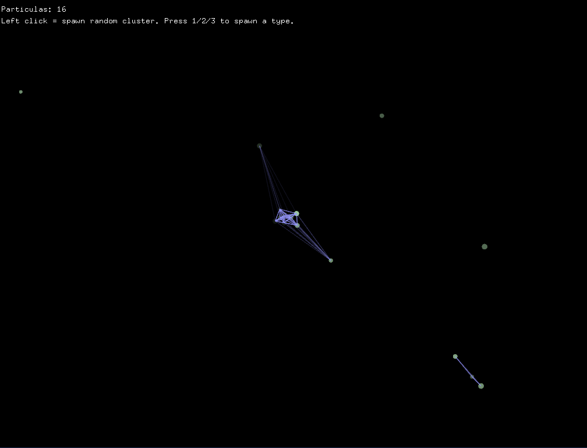
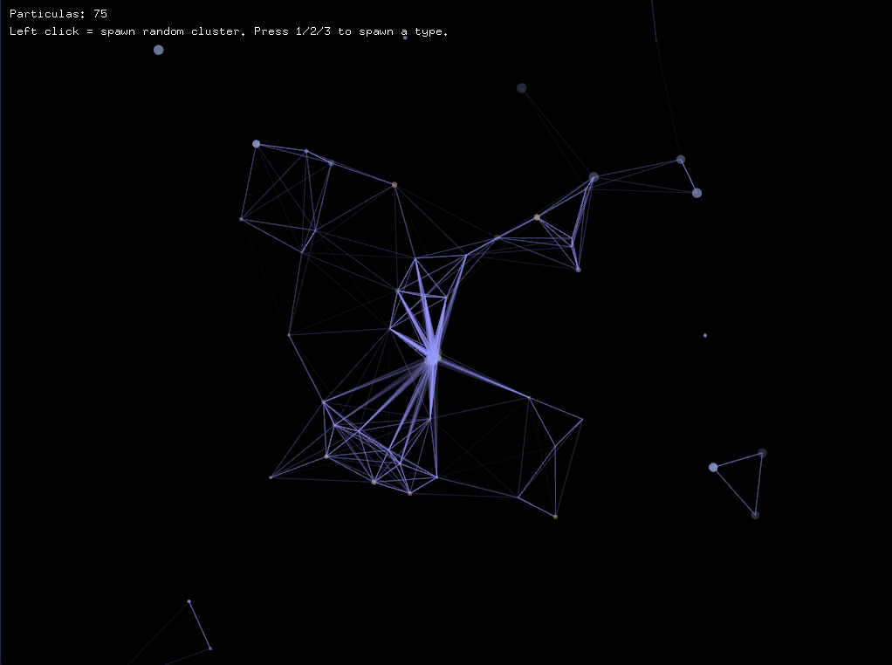
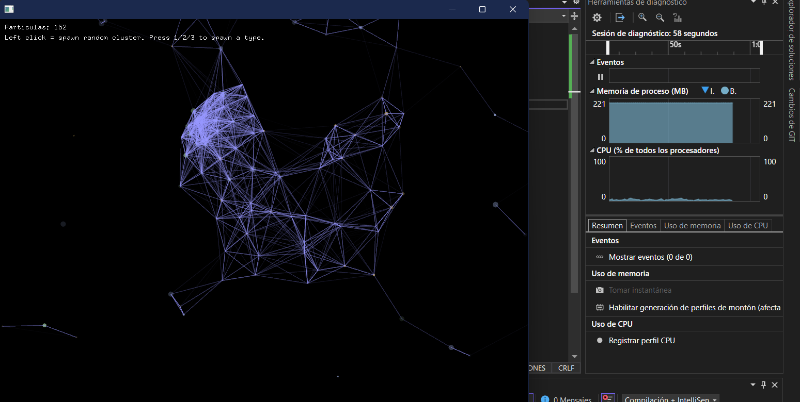

Para hcer mi trabajo con el fin de implementar un proyecto de arte generativo, documentando en detalle cómo se aplican e impactan las abstracciones de OOP en el proyecto, decidí tomar el código que utilicé en las "Experiencias de aprendizaje 4" que sería el siguiente:

main.cpp
```cpp
#include "ofApp.h"
#include "ofMain.h"

int main() {
	ofSetupOpenGL(1024, 768, OF_WINDOW);
	ofRunApp(new ofApp());
}
```
ofApp.cpp
```cpp
#include "ofApp.h"

void ofApp::setup() {
	ofBackground(0);
	ofSetFrameRate(60);
}

void ofApp::update() {
	for (int i = stars.size() - 1; i >= 0; i--) {
		stars[i]->update();
		if (stars[i]->isDead()) {
			delete stars[i];
			stars.erase(stars.begin() + i);
		}
	}
}

void ofApp::draw() {
	for (auto & star : stars) {
		star->draw();
	}

	for (int i = 0; i < stars.size(); i++) {
		for (int j = i + 1; j < stars.size(); j++) {
			float d = ofDist(stars[i]->pos.x, stars[i]->pos.y,
				stars[j]->pos.x, stars[j]->pos.y);
			if (d < 150) {
				ofSetColor(150, 150, 255, ofMap(d, 0, 150, 255, 0));
				ofDrawLine(stars[i]->pos, stars[j]->pos);
			}
		}
	}
}

void ofApp::mousePressed(int x, int y, int button) {
	ofPoint randomPos(ofRandomWidth(), ofRandomHeight());
	stars.push_back(new Star(randomPos));
}
```
ofApp.h
```cpp
#pragma once
#include "ofMain.h"

class Star {
public:
	ofPoint pos;
	float size;
	int lifetime;

	Star(ofPoint _pos) {
		pos = _pos;
		size = ofRandom(2, 5);
		lifetime = ofRandom(200, 400);
	}

	void update() {
		lifetime--;
	}

	void draw() {
		ofSetColor(255, 255, 200);
		ofDrawCircle(pos, size);
	}

	bool isDead() {
		return lifetime <= 0;
	}
};

class ofApp : public ofBaseApp {
public:
	void setup();
	void update();
	void draw();

	void mousePressed(int x, int y, int button);

	vector<Star *> stars;
};
```

Por medio de lo aprendido en la unidad y con ayuda de algunas sugerencias de ChatGPT cambié el código aplicado a lo que se nos pide:

***Código modificado***

main.cpp
```cpp
#include "ofApp.h"
#include "ofMain.h"

int main() {
	ofSetupOpenGL(1024, 768, OF_WINDOW);
	ofRunApp(new ofApp());
}
```
ofApp.cpp
```cpp
#include "ofApp.h"

void ofApp::setup() {
	ofBackground(0);
	ofSetFrameRate(60);
	ofSetBackgroundAuto(true);
}

void ofApp::update() {
	for (auto & p : particles) {
		p->update();
	}

	particles.erase(
		std::remove_if(particles.begin(), particles.end(),
			[](const std::unique_ptr<Particle> & p) { return p->isDead(); }),
		particles.end());
}

void ofApp::draw() {
	for (const auto & p : particles) {
		p->draw();
	}

	const float connectionDist = 150;
	for (size_t i = 0; i < particles.size(); ++i) {
		for (size_t j = i + 1; j < particles.size(); ++j) {
			float d = particles[i]->pos.distance(particles[j]->pos);
			if (d < connectionDist) {
				ofSetColor(150, 150, 255, ofMap(d, 0, connectionDist, 255, 0));
				ofDrawLine(particles[i]->pos, particles[j]->pos);
			}
		}
	}

	ofSetColor(255);
	ofDrawBitmapString("Particulas: " + ofToString(particles.size()), 10, 20);
	ofDrawBitmapString("Left click = spawn random cluster. Press 1/2/3 to spawn a type.", 10, 40);
}

void ofApp::mousePressed(int x, int y, int button) {
	const int n = 8;
	for (int i = 0; i < n; ++i) {
		ofVec2f pos(x + ofRandom(-6, 6), y + ofRandom(-6, 6));
		float r = ofRandom(0, 1.0f);
		if (r < 0.40f) {
			particles.push_back(std::make_unique<Wanderer>(pos));
		} else if (r < 0.80f) {
			particles.push_back(std::make_unique<Spark>(pos));
		} else {
			particles.push_back(std::make_unique<Attracted>(pos));
		}
	}
}

void ofApp::keyPressed(int key) {
	if (key == '1') {
		particles.push_back(std::make_unique<Wanderer>(ofVec2f(ofRandomWidth(), ofRandomHeight())));
	} else if (key == '2') {
		particles.push_back(std::make_unique<Spark>(ofVec2f(ofRandomWidth(), ofRandomHeight())));
	} else if (key == '3') {
		particles.push_back(std::make_unique<Attracted>(ofVec2f(ofRandomWidth(), ofRandomHeight())));
	} else if (key == 'c' || key == 'C') {
		particles.clear();
	}
}
```
ofApp.h
```cpp
#pragma once
#include "ofMain.h"
#include <memory>
#include <vector>

class Particle {
public:
	ofVec2f pos;
	ofVec2f vel;
	float size;
	int lifetime;

	Particle(const ofVec2f & p)
		: pos(p)
		, vel(0, 0)
		, size(ofRandom(2, 5))
		, lifetime((int)ofRandom(120, 420)) { }

	virtual ~Particle() = default;

	virtual void update() {
		pos += vel;
		lifetime--;
	}

	virtual void draw() const {
		ofSetColor(255, 255, 200);
		ofDrawCircle(pos, size);
	}

	virtual bool isDead() const {
		return lifetime <= 0;
	}
};

class Wanderer : public Particle {
private:
	float noiseSeedX, noiseSeedY;

public:
	Wanderer(const ofVec2f & p)
		: Particle(p) {
		noiseSeedX = ofRandom(0, 1000);
		noiseSeedY = ofRandom(0, 1000);
		size = ofRandom(1.5, 6);
	}

	void update() override {
		float nx = ofNoise(noiseSeedX, ofGetElapsedTimef() * 0.2f) - 0.5f;
		float ny = ofNoise(noiseSeedY, ofGetElapsedTimef() * 0.2f) - 0.5f;
		vel += ofVec2f(nx, ny) * 0.8f;
		vel.limit(4.0f);
		Particle::update();
	}

	void draw() const override {
		ofSetColor(180, 200, 255, ofMap(lifetime, 0, 420, 0, 255));
		ofDrawCircle(pos, size);
	}
};

class Spark : public Particle {
public:
	Spark(const ofVec2f & p)
		: Particle(p) {
		vel = ofVec2f(ofRandom(-4, 4), ofRandom(-4, 4));
		size = ofRandom(1, 3.5);
	}

	void update() override {
		vel *= 0.98f;
		Particle::update();
	}

	void draw() const override {
		ofSetColor(255, 220, 120, ofMap(lifetime, 0, 420, 0, 255));
		ofDrawCircle(pos, size);
	}
};

class Attracted : public Particle {
public:
	Attracted(const ofVec2f & p)
		: Particle(p) {
		vel = ofVec2f(ofRandom(-1, 1), ofRandom(-1, 1));
		size = ofRandom(2.5, 5.0);
	}

	void update() override {
		ofVec2f mouse(ofGetMouseX(), ofGetMouseY());
		ofVec2f dir = (mouse - pos);
		float d = dir.length();
		if (d > 0.001f) {
			dir.normalize();
			float strength = ofMap(d, 0, 400, 0.9, 0.02, true);
			vel += dir * strength;
			vel.limit(6.0f);
		}
		Particle::update();
	}

	void draw() const override {
		ofSetColor(200, 255, 200, ofMap(lifetime, 0, 420, 0, 255));
		ofDrawCircle(pos, size);
	}
};

class ofApp : public ofBaseApp {
public:
	void setup();
	void update();
	void draw();

	void mousePressed(int x, int y, int button);
	void keyPressed(int key);

	std::vector<std::unique_ptr<Particle>> particles;
};
```

***Explicación de las decisiones OOP***

- **Encapsulamiento:** Cada Particle agrupa su estado (pos, vel, size, lifetime) y sus comportamientos (update(), draw(), isDead()). Las clases derivadas manipulan su propio estado privado (por ejemplo Wanderer tiene noiseSeedX/Y). Esto mantiene la lógica relacionada con una partícula dentro de su clase.

- **Herencia:** Wanderer, Spark y Attracted heredan de Particle. Reutilizan el código común (posición, vida, Particle::update()), evitando duplicar lógica.

- **Polimorfismo:** usamos punteros a Particle (std::unique_ptr<Particle>) y llamamos update() y draw() de forma polimórfica. Cada subclase implementa su propia versión para un comportamiento distinto — el bucle de ofApp no necesita conocer qué tipo exacto es cada partícula, solo invoca la interfaz común.

- **Gestión de memoria segura:** std::unique_ptr evita fugas y elimina la necesidad explícita de delete. La eliminación de partículas muertas se hace con erase-remove_if sin mover objetos bruscamente.

### Experimentación

- **Pruebas Generales**



- En la imagen 1 se puede ver como al oprimir el 1 se generan circulos morados o azules que duran poco y van con velocidad.



- Al oprimir el 2 aparecen puntos amarillos que son más lentos pero que permanecen por más tiempo.



- Cuando oprimimos el 3 aparecen puntos verdes que se vuelven más rápidos mientras más se acercan al cursor, además lo persiguen.



- Finalmente, cuando se oprime el click izquierdo se genera un grupo de puntos desde el punto en el que se dió click.

- **Utiliza las herramientas de Visual Studio para medir el uso de memoria y rendimiento**



- **¿Cómo afectan las decisiones de diseño OOP al rendimiento?**

Cuando uso herencia y métodos virtuales, el programa se organiza mejor porque cada clase tiene su propio comportamiento. Pero descubrí que esto hace que el programa sea un poquito más lento, porque cada vez que llamo a un método virtual el computador tiene que buscarlo en una “tabla” (vtable). Con pocas partículas no se nota, pero si pongo miles sí puede bajar la velocidad.

- **¿Cómo optimicé el código basándome en el análisis?**

Después de medir, me di cuenta de que lo que más gastaba tiempo era dibujar miles de partículas y calcular las líneas entre ellas. Para optimizar probé dos cosas:

Reducir la cantidad de partículas activas.

Usar un solo mesh para dibujar varias partículas en lugar de llamarlas una por una.
Eso ayudó a que el programa corriera más fluido.

- **¿Qué alternativas hay para evitar métodos virtuales?**

En lugar de usar herencia y virtual, se puede tener una sola clase Particle y dentro usar un tipo (por ejemplo un número o un enum) para decidir el comportamiento. Así el programa hace un switch en lugar de usar polimorfismo. Eso corre más rápido, aunque el código queda menos ordenado y más difícil de mantener.

- **¿Cómo puedo optimizar mi proyecto de arte generativo en openFrameworks para mejorar el rendimiento? ¿Qué impacto tienen los métodos virtuales y cómo puedo minimizar su sobrecarga?**

***ChatGPT dijo***
1. ¿Cómo optimizar el rendimiento en un proyecto de arte generativo?

En openFrameworks, lo que más pesa en rendimiento suele ser:

El dibujo (draw calls): cada ofDrawCircle o ofDrawLine hace una llamada a OpenGL. Miles de llamadas por frame bajan mucho el FPS.

✅ Solución: usar ofVboMesh para dibujar muchas partículas en una sola llamada.

Cálculo de conexiones (distancias entre partículas): si usas doble bucle O(n²), se vuelve lento con más de 1,000 partículas.

✅ Solución: usar espacial hashing o grids para comparar solo partículas cercanas.

Gestión de memoria: crear y borrar partículas constantemente puede fragmentar memoria.

✅ Solución: usar std::vector con reserve() o un object pool para reciclar partículas.

2. ¿Qué impacto tienen los métodos virtuales?

Los métodos virtuales permiten el polimorfismo (que cada subclase tenga su propia versión de update() o draw()).

Internamente, cada llamada virtual hace un salto indirecto usando una tabla (vtable).

El impacto en rendimiento es pequeño por partícula, pero con decenas de miles de llamadas por frame puede notarse.

Normalmente, el costo de dibujar en pantalla es mucho mayor que el de llamar a un método virtual.

3. ¿Cómo minimizar la sobrecarga de los métodos virtuales?

Usar polimorfismo solo donde importa. Ejemplo: que draw() sea virtual, pero que update() sea común en la clase base.

Composición en lugar de herencia. Por ejemplo, tener un Particle simple y agregarle “comportamientos” como funciones o lambdas en un vector.

CRTP (Curiously Recurring Template Pattern). Es un patrón con plantillas que elimina el coste de las tablas virtuales en tiempo de compilación.

Agrupar partículas por tipo. Así, puedes evitar virtuales dentro del loop y en lugar de eso tener un bucle para cada tipo de partícula.

✅ En conclusión:

La optimización más grande la vas a lograr reduciendo draw calls y mejorando la detección de conexiones.

Los métodos virtuales tienen un coste, pero es menor comparado con el dibujo y los cálculos pesados.

Si quieres exprimir rendimiento, puedes reemplazar herencia + virtuales por un sistema basado en tipos (switch) o composición.

### Reflexión y ajuste Final

- **¿Cómo influyó el entendimiento de los mecanismos internos de OOP en el proyecto?**

Entender cómo funciona la herencia, el polimorfismo y la encapsulación me ayudó a organizar mejor el código. Pude crear diferentes tipos de partículas con sus propios comportamientos sin tener que repetir todo desde cero. También entendí que por dentro, cuando uso métodos virtuales, el programa hace un “salto” a través de una tabla (vtable), y eso me hizo pensar en el impacto que podía tener en el rendimiento si tenía muchas partículas.

- **¿Qué desafíos enfrentaste y cómo los superaste?**

El principal reto fue que cuando había muchísimas partículas, el programa empezaba a ir más lento. Al principio pensé que era solo por los métodos virtuales, pero luego descubrí que lo que más gastaba era dibujar y calcular distancias entre partículas. Para mejorar eso, probé reducir la cantidad de partículas y también usé formas más simples de dibujar. Así logré que el programa fuera más fluido.

- **¿Qué aprendiste sobre el equilibrio entre diseño y eficiencia?**

Aprendí que usar OOP hace que el código sea más claro y fácil de entender, pero a veces puede hacerlo un poco más lento. Entonces, hay que buscar un equilibrio: usar clases y herencia donde realmente ayudan a organizar el proyecto, y optimizar o simplificar donde el rendimiento sea más importante. En otras palabras, no se trata solo de que el código sea bonito, sino también de que corra rápido.

- **Ayúdame a revisar mi proyecto para asegurarme de que sigo las mejores prácticas de programación orientada a objetos en C++. ¿Qué aspectos debo considerar en términos de encapsulamiento, herencia y polimorfismo?**

***ChatGPT dijo***
🔒 1. Encapsulamiento

El objetivo es proteger el estado interno de tus clases y exponer solo lo necesario.

Miembros privados/protegidos:

Haz que los atributos (pos, vel, lifetime, etc.) sean private o protected.

Expón acceso mediante métodos públicos (getters/setters) si realmente lo necesitas.

Const-correctness:

Métodos que no cambian el estado deben marcarse como const (bool isDead() const, void draw() const).

Inmutabilidad donde aplique:

Usa const en parámetros de funciones que no modifiques (const ofVec2f &pos).

Inicialización:

Prefiere listas de inicialización en constructores (Particle(const ofVec2f &p) : pos(p), ... {}).

🧬 2. Herencia

La herencia debe expresar una relación “es un” (is-a) y no usarse como mecanismo de reutilización a ciegas.

Clase base abstracta:

Declara virtual void update() = 0; y/o virtual void draw() const = 0; si quieres que sea puramente polimórfica.

Destructor virtual:

Si vas a usar punteros a la clase base (Particle* o unique_ptr<Particle>), la clase base debe tener destructor virtual (virtual ~Particle() = default;).

Evita herencia innecesaria:

Si varias clases comparten comportamiento pero no cumplen una relación clara de herencia, considera composición (ej. Behavior o Force aplicados a Particle).

🔄 3. Polimorfismo

El polimorfismo te da flexibilidad, pero en C++ también tiene coste.

Uso correcto de virtual:

Marca como override los métodos que sobreescriben la base (void update() override).

Marca los que no deben sobreescribirse como final.

Minimizar sobrecarga:

Usa polimorfismo solo donde sea necesario (ej. draw() puede ser polimórfico, pero update() podría ser común).

Alternativas:

Si necesitas rendimiento extremo, considera plantillas (CRTP) o composición en lugar de polimorfismo dinámico.

⚙️ 4. Otros aspectos de buenas prácticas en C++

Gestión de memoria segura:

Usa std::unique_ptr o std::shared_ptr en lugar de new/delete manuales.

Evita fugas de memoria borrando partículas muertas con erase-remove_if.

Regla de cero:

Si no necesitas copiar o mover objetos, no declares constructores de copia ni asignaciones: deja que el compilador lo maneje.

Eficiencia:

Reserva memoria en vectores (particles.reserve(1000)).

Evita pasar objetos grandes por valor → usa referencias const.

Legibilidad:

Nombres claros (Particle, Wanderer, Attracted).

Clases cortas y con una sola responsabilidad.

✅ En resumen:
Cuando revises tu proyecto, pregúntate:

¿Estoy escondiendo lo que no debe ser accesible (encapsulamiento)?

¿La herencia que uso refleja relaciones claras de “es un” y no estoy abusando de ella?

¿El polimorfismo lo estoy aplicando solo donde aporta claridad/flexibilidad, sin afectar demasiado el rendimiento?

### Evidencias de los resultados de aprendizaje

**RAE1**

En mi proyecto de arte generativo en openFrameworks desarrollé un sistema de partículas usando la programación orientada a objetos.

- Usé encapsulamiento para organizar las propiedades y métodos de cada partícula.

- Implementé herencia creando una clase base Particle y clases derivadas como Star y MovingStar, cada una con su propio comportamiento.

- Apliqué polimorfismo, ya que todas las partículas comparten la misma interfaz (update() y draw()), pero se comportan diferente dependiendo de su tipo.

- El proyecto es interactivo porque el usuario puede hacer clic con el mouse para crear nuevas partículas que se comportan de manera distinta y generan conexiones visuales con otras.

🔹 RAE2

Para asegurar que el proyecto funciona correctamente hice pruebas tanto a nivel de partes como del sistema completo:

*Pruebas de partes (unitarias):*

- Verifiqué que el método isDead() eliminara correctamente las partículas cuando se acaba su vida.

- Revisé que update() cambiara la posición solo en las partículas móviles.

- Probé que draw() pintara círculos visibles en pantalla con el color y tamaño esperados.

*Pruebas del todo (integración):*

- Creé muchas partículas para ver si el sistema mantenía el rendimiento.

- Probé clics rápidos y en diferentes zonas de la pantalla para confirmar que todas las partículas reaccionaban.

- Revisé que las líneas de conexión solo aparecieran cuando las partículas estaban a menos de 150 px de distancia.

[Video de Pruebas](https://youtu.be/Nc6EGHsriKI)